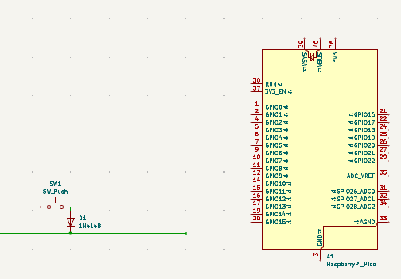
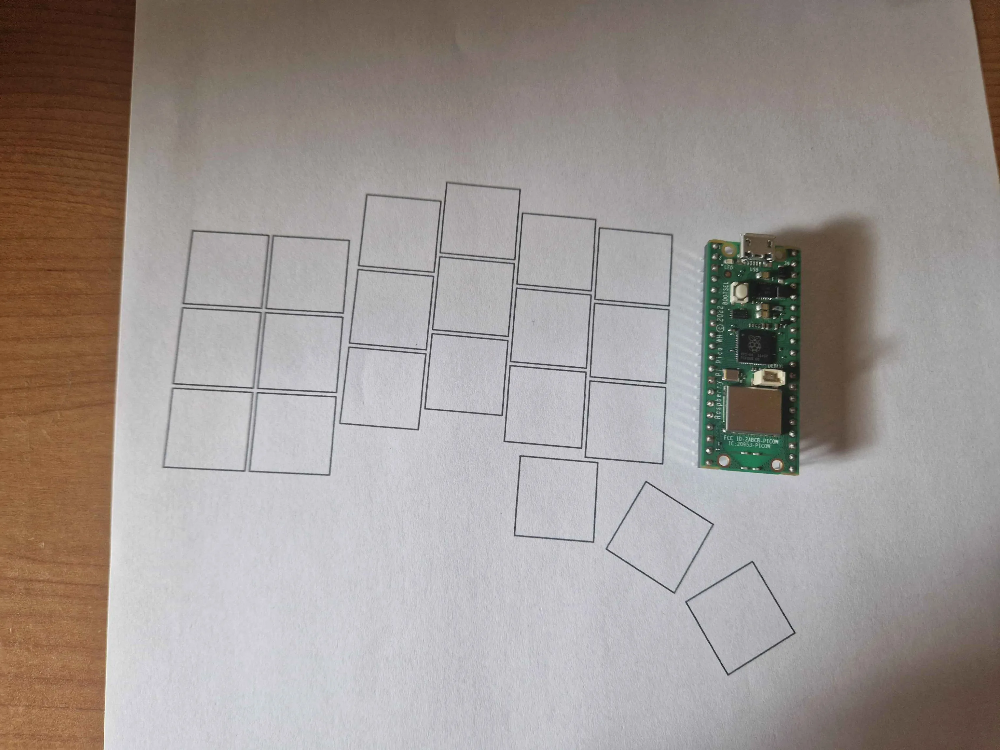
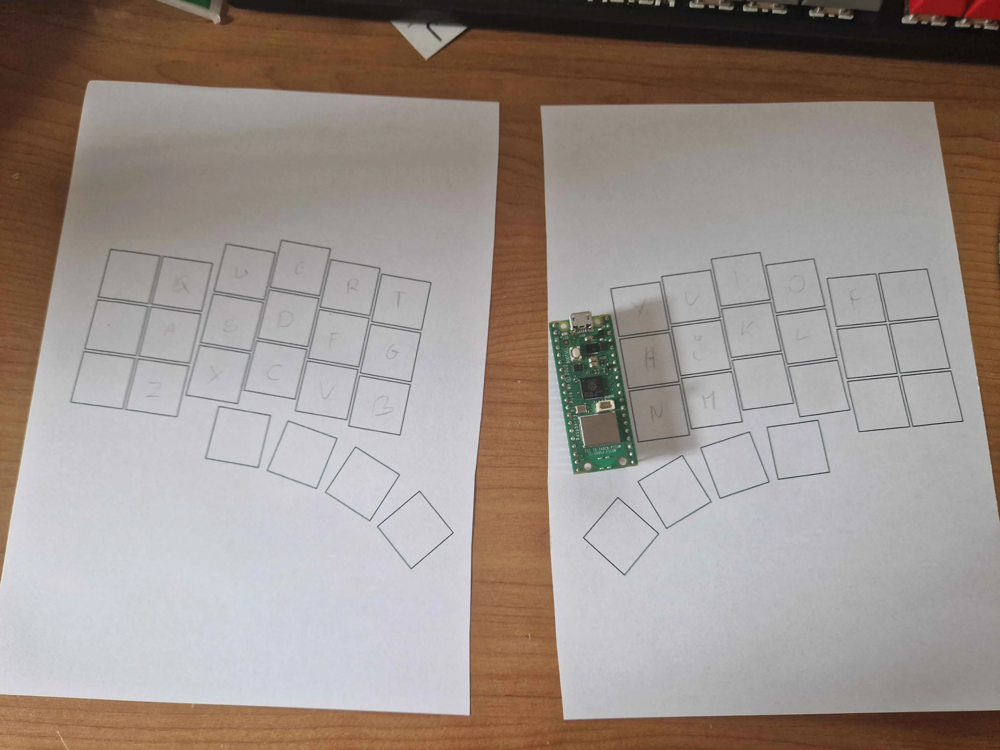
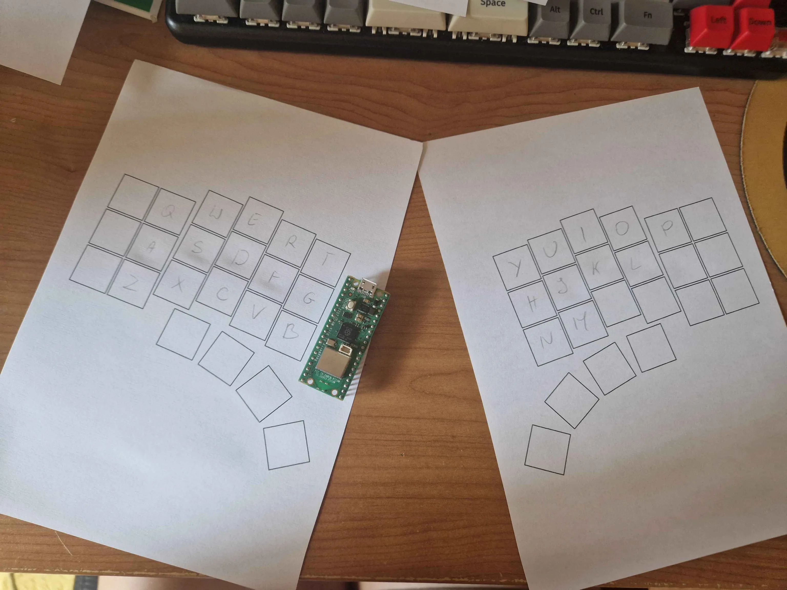
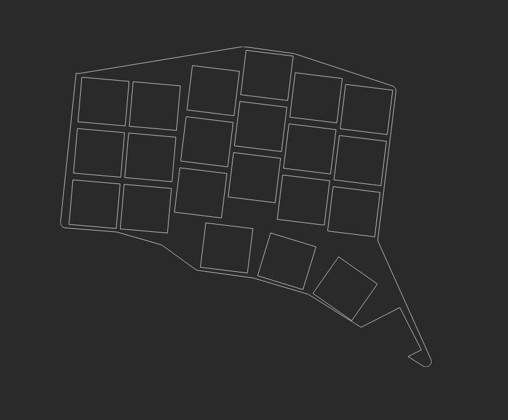
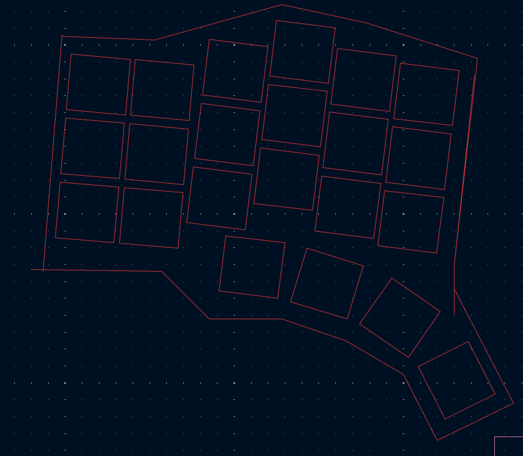
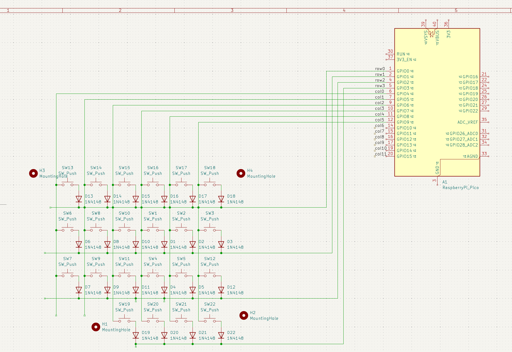
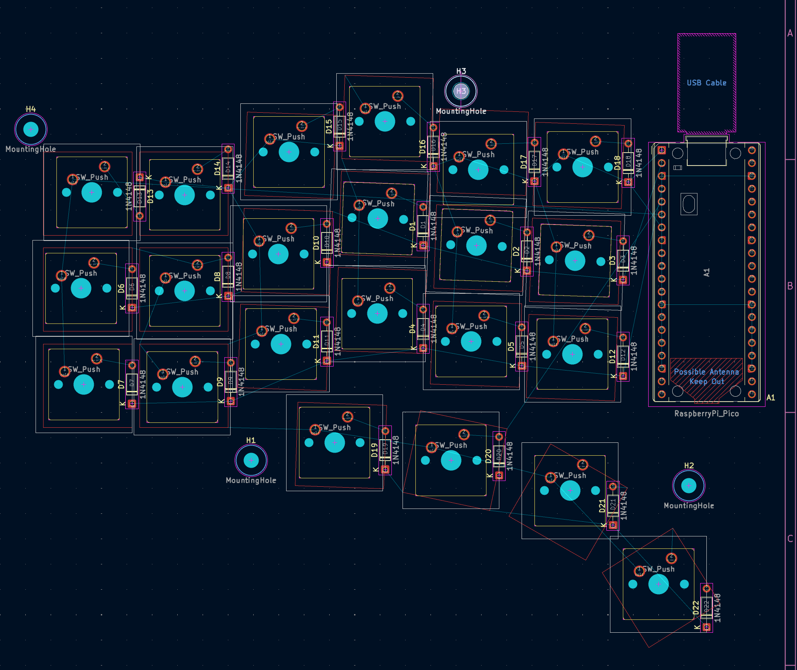
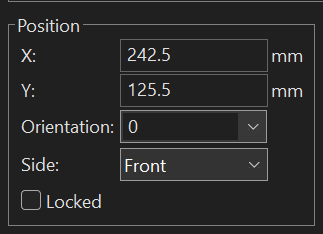

## Research
### 22.08.2026 - 1,5h

I want to make a split keybord with:
- low profile switches
- 6 columns (i originally wanted 5 but then i would have to worry about tab, backspace etc so i will keep 6)
- 3 rows (f row and numbers will be fn + first or second row)
- 3 keys per each thumb (ctrl, fn, alt, shift, space + sth else)
- one pico per each keyboard part because it looks cool (they will be visible in the inside part of the keyboard)
- the keyboard will be wired (i use linux btw)
- the two parts will be connected together with 4 pins (2 for data, 2 for power)

## Kicad setup
### 23.08.2026 - 0,5h
I installed Kicad on my arch linux, installed Marbastlib but the footprints didn't load correctly (even the ones that should be in the default library), i heard that kicad has problems on linux, so i tried windows and it works now  
> TODO: someone told me that "on arch the library packages are separate from the main program package and need to be installed as well. (`kicad-library` and `kicad-library-3d`)"
---
I imported pico, a diode and a switch  
  
now i need to make more keys and arrange them  

## First prints
### 23.08.2026 - 2,5h  
I discovered https://ergogen.xyz/, i was very worried that i will have to place every key manually...  
----
The first version with pico (for scale and also this is where i want to place it)  
  
----
Second version (4 thumb keys, i really like it), the only problem is that the fourth thumb key is too far away

---
Third version, different angle for thumb keys (now i can reach every thumb key)

## Cable research
### 23.08.2026 - 1h
And a long discussion on slack (+ my research) about the connection between the keyboard parts (trrs vs ps/2 vs jst vs pogo)
- trrs:
    - easy, popular, small, good-looking
    - it can shortcircuit my board
- ps/2:
    - safe
    - it doesn't look good, less popular
- jst:
    - easy
    - looks bad
- pogo pins:
    - they are just cool, and also easy
    - difficult to find, expensive

## Ergogen outline
### 24.08.2026 - 3h
i tried to make an outline in ergogen like here https://flatfootfox.com/ergogen-part2-outlines/, but i'm not able to make it good for the last thumb  
I had to understand how the outline works by trial and error so it took a lot of time but i think i got it  

---
i also tried to make the outline in kicad but it looks ~  
idk why but when i import .kicad_pcb to kicad there is only a shape  

---
> i was told to make the schematic first so i'll try that  

## Schematic
### 24.08.2026 - 2h

i did everything like on my schematics but the wires look very chaotic compared to the ones in the guide  
  
Also I discovered that i can rotate elements by pressing E and adjusting orientation  
